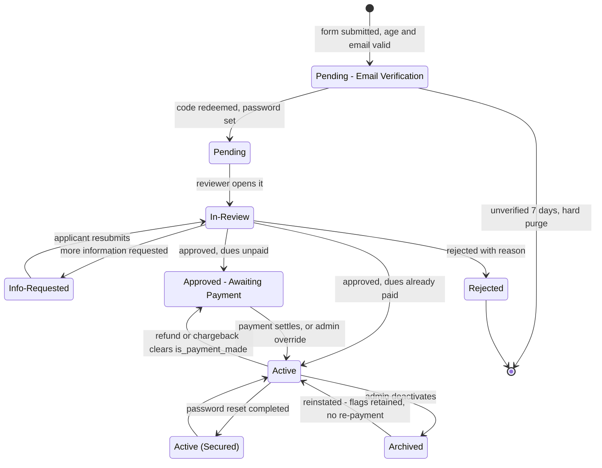
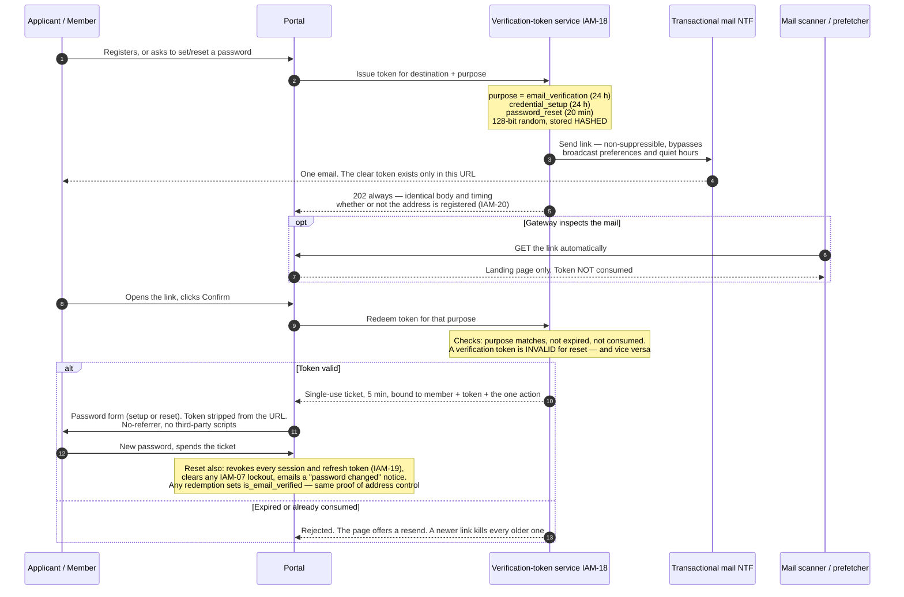
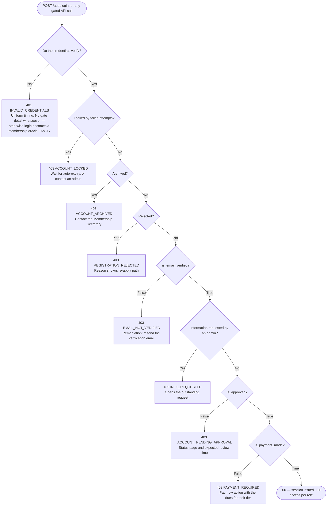
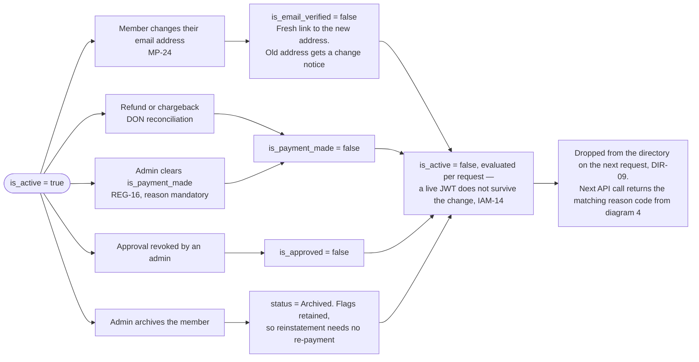

# Rawla Portal — Module-wise Detailed Requirements

**Source:** `docs/requirements/Rawla_Portal_High_level_Requirements_updated_SEP_02_2026.xlsx` (10 tabs, dated 02-Sep-2026)
**Organisation:** Rajputana Rawla of America (RROA / RRA) — a US-based regional community body with geographic chapters
**Document status:** Derived analysis — every requirement below is traced to a source cell; anything marked **[NEW]** is an inferred gap not present in the workbook, or a later customer instruction.
**Revision 7 (05-Sep-2026):** reverted to **emailed verification links** for every credential flow — registration verification, first-password setup and password reset. The 6-digit code is withdrawn; `verification_token` replaces `verification_code`. IAM-06 returns to the workbook's own wording (`Reg!B12`). Link-specific hardening added: prefetch safety, referrer suppression and token-stripping. See IAM-01/05/06/18, REG-21/22, ADM-12, §5.5 and §6.2.
**Revision 6 (05-Sep-2026):** added **§5.5 — five flow diagrams** covering the account-creation path end to end: validation and age gate, the code mechanism across all three purposes, vetting, payment, the blocked-login precedence ladder, and every route out of active status.
**Revision 5 (05-Sep-2026) — superseded by Revision 7:** customer-confirmed — **initial credential setup also moves to the 6-digit code** (`purpose = credential_setup`), retiring the emailed setup link, and **redeeming a password-reset code sets `is_email_verified`**. Links are now gone from every credential flow. See IAM-01 and REG-12 (rewritten), §6.2.
**Revision 4 (05-Sep-2026) — superseded by Revision 7:** password reset now uses the **same 6-digit code mechanism** as email verification, served by one purpose-scoped `verification_code` service. Reset links are replaced by codes. See IAM-05/IAM-06 (rewritten), IAM-18…IAM-20, §6.2, ADM-12.
**Revision 3 (05-Sep-2026):** account creation now **requires an email address**, which must be verified by an emailed link (a 6-digit code in Revisions 3–6) (`is_email_verified`). Verification is the third activation gate, and every blocked login/API call must name the reason. See MP-24, REG-20…REG-23, IAM-16/IAM-17, ADM-12.
**Revision 2 (05-Sep-2026):** account activation now requires **both** admin approval and a settled membership payment (`is_active = is_approved && is_payment_made`), the payment flag is admin-overridable with a mandatory reason, and account creation is blocked below a configurable minimum age (default 18). See MP-22/MP-23, REG-15…REG-19, IAM-14/IAM-15, ADM-09…ADM-11.
**Target platform:** the `helix-x` monorepo (pnpm + Turborepo; NestJS backend, React/Vite frontend, `packages/{framework,extension}/ui/*` feature-module packages).

---

## 1. Purpose and reading guide

The workbook states seven high-level categories (`High level requirements` tab):

| # | Category | High-level statement |
|---|---|---|
| 1 | Member Profile | Manage all aspects of member profiles |
| 2 | Registration | Registration approval and security of members |
| 3 | Donations & Charity Management | Donation management and charity-related requirements |
| 4 | Events & Volunteer Management | Events (cultural and charity) and volunteer management |
| 5 | Communications | 1-1 and mass communications, EC updates |
| 6 | Administration | Administration of the portal |
| 7 | Non Functional | One application serving mobile + desktop, plus an app-wrapped solution |

Those seven categories are **capability areas**, not deliverable modules. This document decomposes them into **16 implementable modules** (plus 3 cross-cutting platform services), each with its own data model, functional requirements, API surface, screens, RBAC rules and acceptance criteria.

**Requirement ID scheme:** `<MODULE-CODE>-<nn>`. The **Source** column cites the workbook tab and row, e.g. `Donations!B11` — so every line is auditable back to the customer's sheet.

**Priority** values are carried over from the workbook (`High` / `Med` / `Low`) where the sheet supplied one; otherwise they are proposed and marked with `*`.

---

## 2. Module map

| Code | Module | Covers source tabs | Backend home | Frontend feature module | Feature flag | Phase |
|---|---|---|---|---|---|---|
| **MP** | Member Profile & Household | Member profile, Spouse profile, Child profile | `packages/extension/backend/community-core` | `packages/extension/ui/members-ui` | `VITE_FEATURE_MEMBERS` | 1 |
| **REG** | Registration & Onboarding Workflow | Member Registration process (Intake, Approval) | `packages/extension/backend/community-core` | `packages/extension/ui/registration-ui` | `VITE_FEATURE_REGISTRATION` | 1 |
| **IAM** | Identity, Security & Access | Member Registration process (Security, Recovery), Administration (Access, Security) | `packages/framework/backend/authentication` *(exists — extend)* | `packages/framework/ui/auth-ui` *(exists — extend)* | `VITE_FEATURE_AUTH` | 1 |
| **CHP** | Chapters & Multi-Tenancy | Administration, Member profile, Events (Finance) | `packages/extension/backend/community-core` | `packages/extension/ui/chapters-ui` | `VITE_FEATURE_CHAPTERS` | 1 |
| **DIR** | Member Directory & Networking | Communications (P2P), Member profile | `packages/extension/backend/community-core` | `packages/extension/ui/directory-ui` | `VITE_FEATURE_DIRECTORY` | 2 |
| **DON** | Donations & Fundraising | Donations and Charity Management (Intake, Fund Mgmt) | `packages/extension/backend/giving` | `packages/extension/ui/donations-ui` | `VITE_FEATURE_DONATIONS` | 2 |
| **TAX** | Receipting, Tax & Financial Compliance | Donations (Tax/Legal, Analytics) | `packages/extension/backend/giving` | `packages/extension/ui/giving-statements-ui` | `VITE_FEATURE_TAX_STATEMENTS` | 2 |
| **EVT** | Events & Ticketing | Events & Volunteer Mgmt (Ticketing, Scheduling, Logistics, On-Site) | `packages/extension/backend/events` | `packages/extension/ui/events-ui` | `VITE_FEATURE_EVENTS` | 2 |
| **VOL** | Volunteer Management | Events & Volunteer Mgmt (Recruitment, Engagement, Tracking) | `packages/extension/backend/events` | `packages/extension/ui/volunteers-ui` | `VITE_FEATURE_VOLUNTEERS` | 3 |
| **REC** | Recognition & Certificates | Events & Volunteer Mgmt (Recognition) | `packages/extension/backend/events` | `packages/extension/ui/recognition-ui` | `VITE_FEATURE_RECOGNITION` | 3 |
| **COM** | Communications & Broadcast | Communications (Broadcast, Security) | `packages/extension/backend/messaging` | `packages/extension/ui/communications-ui` | `VITE_FEATURE_COMMUNICATIONS` | 2 |
| **GOV** | Leadership & Governance (EC Corner) | Communications (Leadership) | `packages/extension/backend/community-core` | `packages/extension/ui/governance-ui` | `VITE_FEATURE_GOVERNANCE` | 3 |
| **P2P** | Member-to-Member Engagement | Communications (P2P, Security) | `packages/extension/backend/messaging` | `packages/extension/ui/community-ui` | `VITE_FEATURE_COMMUNITY` | 4 |
| **ADM** | Administration & Master Data | Administration (Data, Automation, Integration) | `packages/extension/backend/community-core` + `apps/backend` | `packages/framework/ui/admin-ui` *(exists — extend)* | `VITE_FEATURE_ADMIN_UI` | 1 |
| **RPT** | Reporting & Analytics | Administration (Reports), Donations (Analytics) | `packages/extension/backend/reporting` | `packages/extension/ui/reports-ui` | `VITE_FEATURE_REPORTS` | 3 |
| **PLT** | Platform, PWA & Experience | Non Functional | cross-app | `apps/frontend` shell | n/a | 1 |

### 2.1 Cross-cutting platform services

These are **not** user-facing modules; they are shared services every module above depends on. Building them once avoids three parallel half-implementations.

| Code | Service | Why it must be shared |
|---|---|---|
| **AUD** | Audit & Change Log | Required independently by `Registration!B19`, `Donations!B15` and `Administration!B6`. One append-only log, one viewer, one retention policy. |
| **NTF** | Notification & Template Service | Email / SMS / WhatsApp / in-app delivery is demanded by REG, DON, TAX, EVT, VOL and COM. Channel adapters, templating, per-member opt-out and delivery receipts belong in one place. |
| **MDM** | Master Data & Reference Lists | Gotra, Caste, Thikana/Village, Chapter, Membership Tier, Fund, Volunteer Role are referenced from MP, DIR, DON, EVT and COM. `Administration!B5` makes them admin-editable. |

---

## 3. Cross-cutting foundations

### 3.1 Role model

`Administration!B3` names five roles. Five is not enough to express the rest of the workbook (chapter scoping, youth accounts, pending applicants), so the model below extends it — extensions are marked **[NEW]**.

| Role | Source | Scope | Core capability |
|---|---|---|---|
| Super Admin / Platform Admin | **[NEW]** | Global | Environment config, integrations, backup/restore, impersonation |
| President / National Chair | `Administration!B3` | Global | Full read, governance publishing, escalation recipient (`Administration!B9`) |
| General Secretary | `Administration!B3` | Global | Minutes, announcements, events, communications |
| Finance Secretary | `Administration!B3` | Global | Donations, funds, refunds, tax statements, financial reports |
| Membership Secretary | `Administration!B3`, `Registration!B16` | Global | Registration vetting, approve/reject, member records, offline reference verification |
| Mentor | `Administration!B3` | Global | Read directory + professional profiles, youth mentoring, no financial access |
| Chapter Lead | `Administration!B4` | **Chapter-scoped** | Manage only their US region's members, events, volunteers, chapter finances |
| Event Organiser | **[NEW]** (implied by `Events!C34` "Mobile Access: dashboard for organizers during live events") | Event-scoped | Event setup, check-in, volunteer roster for assigned events |
| Volunteer Coordinator | **[NEW]** (implied by `Events!B10-B16`) | Event/chapter-scoped | Shifts, hours approval, certificates |
| Member | implied throughout | Self + household | Own profile, own household, own giving history, event/volunteer sign-up |
| Youth Member | `Member profile!D21`, `Child profile!B12` | Self | Restricted profile; certificates; parental linkage |
| Applicant | `Registration!J4` | None | Sees only their own application status |
| Unverified Applicant **[NEW]** | customer requirement | None | Email not yet verified: may only re-request the verification email; invisible to the vetting queue |
| Approved — Awaiting Payment **[NEW]** | customer requirement | Self | Approved but not yet paid: sees own status, the dues payment page and nothing else; invisible to the directory |

**Permission naming:** `<resource>:<action>` — e.g. `members:read`, `members:write.self`, `donations:read.financial`, `registration:approve`, `registration:payment.override`, `registration:email.override`, `chapters:manage.own`. These map onto the existing `@helix-x/authentication` `Permissions()` decorator and the `requiredPermissions` metadata on frontend `NavItem`s, so no new authorization primitives are needed.

### 3.2 The three privacy tiers (critical, spans every module)

`Member profile!B15-B17` define a privacy model that the whole system must honour:

| Tier | Rule | Source |
|---|---|---|
| **Tier 1 — Self-edit only** | Only the member may update their own core profile details. | `Member profile!B16` |
| **Tier 2 — Community read-only** | All non-financial member information is readable by every authenticated member — but only behind the login wall; nothing is public. | `Member profile!B17` |
| **Tier 3 — Financial confidential** | No member may see another member's financial information. Visible only to the member themselves and to Finance Secretary / President. | `Member profile!B16` |

Layered on top: `Communications!B12` requires **global and field-level opt-out** for both directory visibility and communications. So the effective visibility of any field is:

```
visible(field, viewer) =
      viewer is the record owner
  OR  viewer holds an explicit override permission (e.g. members:read.financial)
  OR ( field.tier == COMMUNITY
       AND owner.fieldVisibility[field] != HIDDEN
       AND owner.directoryOptIn == true )
```

**Design consequence:** field-level visibility is data, not code. Every profile field carries a `defaultTier` in master data, and each member holds a `field_visibility` override map. A single `ProfileVisibilityService` must be the only path through which profile DTOs are serialised — do not scatter tier checks across controllers.

### 3.3 Household as a first-class entity

`Member profile!B5`, `!E15`, `Spouse profile!B12` and `Child profile!B6` all pivot on a **Household ID** that links multiple profiles to one physical address. Household is therefore an entity in its own right, not an address string copied onto each member:

- One `Household` has exactly one **Head of House** and 0..n members with a `relationship` of Spouse / Child / Parent / Sibling (`Member profile!F16`).
- Household drives: single-transaction family event registration (`Events!B3`), anniversary/birthday recognition (`Member profile!G17`, `!G18`), chapter attribution and mailing address of record.
- A spouse and each child are **linked profiles** (`Member profile!E31`, `!E32`) — they may or may not have login credentials of their own.

### 3.4 Cultural data model (do not genericise these)

The workbook is explicit that this CRM must capture cultural nuance (`Member profile!B1`). These are **not** optional decorations:

| Concept | Field | Note |
|---|---|---|
| Honorific | Kunwar, Baisa, Banna (`Member profile!G7`) | Dropdown, gender-linked |
| **Gotra** | Lineage-based classification (`!E9`) | Used for badge printing (`Events!D9`) and audience segmenting (`Communications!D8`) |
| **Rajput Caste / Sub-Clan** | Sengar, Shaktawat, Rathore, Chauhan… (`!E26`) | **Distinct from Gotra** — the sheet flags this as present on the current form but missing from the new model |
| **Ancestral Village / Thikana** | Native place in Rajasthan (`!E8`) | |
| **Sasural** | Spouse's ancestral thikana (`!E27`) | Only relevant once married |
| **Nanihal** | Mother's ancestral place (`!E28`) | Captured for member and spouse |
| Languages | Hindi, Marwari, Mewari, English (`!E10`) | Multi-select |
| Family history | Long-form lineage narrative (`!E29`) | |

Gotra, Caste and Thikana are all admin-maintained dropdowns (`Administration!B5`) — never free text, or segmentation and badge printing break.

---

## 4. Module MP — Member Profile & Household

> **Purpose:** the system of record for every person in the community. Every other module reads from it.
> **Source tabs:** `Member profile`, `Spouse profile`, `Child profile`.

### 4.1 Data model

#### `member` (primary member record)

| Category | Field | Type | Required | Notes / Source |
|---|---|---|---|---|
| Biographical | Full legal name (first, middle, last) | Text | Yes | `!E6` |
| Biographical | Honorific / Title | Enum (MDM) | No | Kunwar, Baisa, Banna — `!E7` |
| Biographical | Gender | Enum | Yes | Male, Female — `!E25` |
| Biographical | Ancestral Village / Thikana | Text (MDM-assisted) | Yes | `!E8` |
| Biographical | Gotra / Clan | Enum (MDM) | Yes | `!E9` |
| Biographical | Rajput Caste / Sub-Clan | Enum (MDM) | Yes | `!E26` — distinct from Gotra |
| Biographical | Sasural (spouse's thikana) | Text | Conditional | Required only if married — `!E27` |
| Biographical | Nanihal (mother's place) | Text | No | `!E28` |
| Biographical | Languages | Multi-select (MDM) | No | `!E10` |
| Biographical | Family history / background | Long text | No | `!E29` |
| Contact | Email address | Email (unique, case-insensitive) | Yes | **Mandatory for account creation** — it is the login identifier, the verification-code destination and the primary comms point. No account may exist without one — `!E11` + **[NEW]** |
| Contact | Phone / WhatsApp | Phone (E.164) | Yes | Broadcast target — `!E12` |
| Contact | Home address | Structured address | Yes | `!E14` |
| Contact | US Chapter | FK → `chapter` | Auto | Auto-assigned from state — `!E13`, `Member profile!B9` |
| Household | Household ID | FK → `household` | Yes | `!E15` |
| Household | Relationship | Enum | Yes | Head of House, Spouse, Child, Parent — `!E16` |
| Household | Date of birth | Date | Yes | Youth/senior tracking — `!E18` |
| Household | Wedding date | Date | Conditional | Anniversary recognition — `!E17` |
| Professional | Industry / Field | Text (MDM-assisted) | No | `!E19` |
| Professional | Job title | Text | No | `Member profile!B10` |
| Professional | Skills / Expertise | Multi-select + text | No | Mentorship matching — `!E20` |
| Professional | Education & professional achievements | Long text | No | `!E30` |
| Professional | LinkedIn URL, Facebook URL | URL | No | **Only if member approves** — `Member profile!B10` |
| Membership | Membership tier | Enum | Yes | Annual, Lifetime, Youth, Associate — `!E21` |
| Membership | Join date | Date | Auto | `!E22` |
| Membership | Volunteer interests | Multi-select | No | Events, Tech, Food, Fundraising, Youth mentoring — `!E23`, `Member profile!B13` |
| Membership | Member ID (public) | Generated | Auto | Issued on approval — `Registration!D18` |
| Membership | Status | Enum | Auto | Pending-Email-Verification / Pending / In-Review / Approved-Awaiting-Payment / Active / Rejected / Archived — `Registration!J4-J8` + **[NEW]** |
| Membership | `is_approved` | Boolean | Auto | Set true **only** by an admin approval decision (REG-09). Never self-serviceable — **[NEW]** |
| Membership | `is_payment_made` | Boolean | Auto | True when the membership payment for the selected tier settles, or when an admin overrides it (REG-16) — **[NEW]** |
| Membership | `is_active` | Boolean (derived) | Auto | **`is_email_verified AND is_approved AND is_payment_made AND status != Archived`.** Not directly writable by anyone — **[NEW]** |
| Membership | `payment_override_by` / `_reason` / `_at` | FK + Text + Timestamp | Conditional | Populated only when `is_payment_made` was set by admin override; reason mandatory — **[NEW]** |
| Membership | `activated_at` | Timestamp | Auto | Set when **all three** gates first close; drives the welcome email (REG-10) — **[NEW]** |
| Verification | `is_email_verified` | Boolean | Auto | True once the applicant follows the emailed verification link and confirms (REG-21). Set **only** by the verification flow or an admin override (REG-23); resets to false if the email address is changed — **[NEW]** |
| Verification | `email_verified_at` | Timestamp | Conditional | When the verification link was confirmed — **[NEW]** |
| Verification | Verification links | → `verification_token` | Auto | Transient token state is **not** held on the member row — it lives in the shared `verification_token` entity below, which serves verification, credential setup and password reset (IAM-18) — **[NEW]** |
| Finance | Total donations | Currency (derived) | Auto | Aggregate, **Tier 3 confidential** — `!E24` |
| Verification | Reference contacts ×2 (name + phone) | Text | Conditional | Two vouching Rawla members — `!E33` |
| Verification | Offline verification flag | Boolean | No | References supplied offline via membership secretary — `!E34` |
| Security | Password | Hashed + salted | Yes | Never stored or shown in plain text — `!E35` |

#### `household`
`id`, `household_id` (public), `head_member_id`, `address` (structured), `chapter_id`, `anniversary_date`, `created_at`.

#### `spouse_profile` — linked record, `Spouse profile` tab
Full legal name; Rajput Caste (may differ from the member's — `Spouse!D5`); Gotra; Ancestral place/Thikana; Nanihal; Family history; Email (optional); Phone/WhatsApp; Household ID (inherited); Relationship = fixed `Spouse`; Date of birth; Wedding date (shared with primary record); Industry/Field; Education & professional achievements.

#### `child_profile` — linked record, `Child profile` tab
Full legal name; Gender; Household ID (inherited); Relationship = fixed `Child`; Date of birth; **Child sequence** (order among siblings — the current form supports up to 3, `Child!D9`); Education level/grade; Educational & professional achievements (**feeds auto-generated certificates**, `Child!D11`); Membership tier auto-derived as `Youth` from DOB (`Child!D12`).

#### `life_event`
`member_id`, `type` (Birth, Wedding, Anniversary, Death **[NEW]**), `event_date`, `notes`, `recognised_at` — `Member profile!B6`.

#### `verification_token` **[NEW]** — one mechanism, several purposes

A single short-lived credential type backing every "we emailed you a link" flow. Owned by IAM (IAM-18), consumed by REG.

| Field | Type | Notes |
|---|---|---|
| `id` | UUID | |
| `member_id` | FK → `member` | Nullable — an application may pre-date the member row |
| `destination` | Email (normalised) | Where the link was sent; the token is bound to it |
| `purpose` | Enum | `email_verification`, `credential_setup`, `password_reset` (extensible: `mfa`, phone/WhatsApp) |
| `token_hash` | Hash | The token is **≥128 bits of cryptographic randomness**, URL-safe, and **stored hashed**. The clear token exists only inside the emailed URL — never in the database, logs, sent-mail table or audit trail |
| `expires_at` | Timestamp | Per-purpose TTL (ADM-12) |
| `consumed_at` | Timestamp | **Single-use** — set when the applicant confirms |
| `created_at`, `last_sent_at`, `created_ip` | Timestamp, Timestamp, IP | Throttling and abuse forensics |

**`purpose` is part of the redemption check, not a label.** A token issued for `email_verification` must be rejected by the password-reset endpoint and vice versa — otherwise the lower-assurance flow becomes an account-takeover path into the higher-assurance one. Tokens are single-use and invalidated by: redemption, expiry, issue of a newer token for the same `(destination, purpose)`, and — for `password_reset` — any successful password change by another route.

**A link carries its secret in a URL, so three rules follow.** They are requirements, not implementation notes:

1. **The emailed link never consumes the token.** `GET` renders a confirmation page; the token is spent only by the `POST` behind an explicit button. Corporate mail scanners and link prefetchers (Safe Links, gateway rewriters, antivirus) follow every URL in an email automatically — a token consumed on `GET` is burned before the member ever sees it, and the flow fails for exactly the corporate mailboxes least able to diagnose it.
2. **The token must not leak sideways.** Landing pages send `Referrer-Policy: no-referrer`, carry no third-party scripts or trackers, and are excluded from query-string logging; the token is stripped from the address bar (`replaceState`) once consumed, so it does not survive in browser history or a shared screenshot.
3. **The landing page stands alone.** A mail app may open the link in a different browser, or on a different device, from the one where registration started — the page must complete the flow from the token alone, with no dependence on the original session or tab.

### 4.2 Functional requirements

| ID | Requirement | Detail | Priority | Source |
|---|---|---|---|---|
| MP-01 | Member management module | Create, read, update and archive member profiles carrying every field in §4.1. | High* | `!B3` |
| MP-02 | Tabular search | Members listed in a table searchable/filterable by any field (name, chapter, gotra, caste, tier, skills, village, status). | High* | `!B4` |
| MP-03 | Detail page | Each member has a full detail page showing the information the list view cannot hold. | High* | `!B4` |
| MP-04 | Household linkage | Link multiple profiles to one physical address with relationship = Spouse / Child / Parent / Sibling. | High* | `!B5` |
| MP-05 | Life-event tracking | Record and surface births, weddings and anniversaries; feed the recognition/greeting engine. | High* | `!B6` |
| MP-06 | Verified contact info | Email, mobile and WhatsApp must be **verified** before being used for broadcasts. Email verification is the mandatory emailed-link flow of REG-21 and is a precondition for the account existing at all; phone/WhatsApp OTP remains a separate, post-activation step. | High* | `!B7` |
| MP-07 | Geographic networking | Surface members by location to promote networking and geographic sub-chapters. | Med* | `!B8` |
| MP-08 | Auto chapter assignment | Derive the US Chapter from the member's state at save time; admin may override. | High* | `!B9` |
| MP-09 | Professional profile | Capture industry, job title and skills for mentorship/sponsorship; link LinkedIn and Facebook **only with the member's explicit approval**. | Med* | `!B10` |
| MP-10 | Membership tier | Assign Annual / Lifetime / Youth / Associate based on the selection made at profile creation. | High* | `!B11` |
| MP-11 | Donation history on profile | Show the member's own giving history and tax receipts, sourced from DON/TAX. | High* | `!B12` |
| MP-12 | Volunteer interests | Capture Event planning, Youth mentoring, Food prep, Tech support; consumed by VOL skill matching. | High* | `!B13` |
| MP-13 | Attendance log | History of RRA conventions and local meetups attended, written by EVT check-in. | Med* | `!B14` |
| MP-14 | Self-service editing | Only the member may edit their own core profile details. | High* | `!B16` |
| MP-15 | Financial confidentiality | No member may view another member's financial information. | High* | `!B16` |
| MP-16 | Authenticated-only visibility | All member information sits behind the auth wall; non-financial fields are read-only-visible to authenticated members. | High* | `!B17` |
| MP-17 | Spouse linked profile | Create/maintain one spouse record per household with the `Spouse profile` field set. | High* | `Spouse!A1` |
| MP-18 | Child linked profiles | Create/maintain multiple child records with sequence ordering; auto-derive Youth tier from DOB. | High* | `Child!A1`, `Child!D12` |
| MP-19 | Field-level privacy controls | Member can mark individual fields hidden from the directory; a global directory opt-out exists. | High | `Communications!D12` |
| MP-20 | Profile completeness indicator **[NEW]** | Show a completion score prompting members to fill lineage/professional data — the workbook's stated goal is to "improve usage of portal" (`!B15`). | Low* | inferred |
| MP-21 | Merge duplicates **[NEW]** | Admin tool to merge two member records, re-pointing donations, registrations and volunteer hours. | Med* | inferred from `Registration!D4` |
| MP-22 | Triple-gate activation **[NEW]** | A member is active **only** when email verification, admin approval and membership payment have *all* landed. `is_active` is computed from `is_email_verified && is_approved && is_payment_made && status != Archived` — it is never a stored, independently settable flag. The gates may close in any order; the account activates when the last one closes. | High | customer requirement |
| MP-23 | Minimum age for account creation **[NEW]** | A person may not create a member profile with a login below the configured minimum age (default **18**, see ADM-09). Age is computed from Date of birth at submission time. Linked `child_profile` records under that age remain permitted — they are dependants in a household, not account holders (see IAM-13). | High | customer requirement |
| MP-24 | Email verification flag **[NEW]** | `is_email_verified` is carried on the member record, shown to admins on the member detail and list views, and is the third activation gate (MP-22). Changing a member's email address — by self-edit or admin edit — clears the flag and re-triggers verification (REG-22); a member whose email is unverified is not a valid broadcast target (MP-06). | High | customer requirement |

### 4.3 API surface (`/api`)

```
GET    /members                     list + filter + paginate      (members:read)
GET    /members/:id                 detail, tier-filtered          (members:read)
PATCH  /members/:id                 self-edit or admin override    (members:write.self | members:write)
GET    /members/me                  current member's full record
PATCH  /members/me/privacy          field visibility + opt-outs
GET    /members/:id/donations       Tier-3 gated                   (self | donations:read)
GET    /members/:id/attendance
GET    /households/:id
POST   /households/:id/spouse
POST   /households/:id/children
PATCH  /households/:id/relationships
GET    /life-events?window=30d      upcoming birthdays/anniversaries
```

### 4.4 Screens

`/members` (searchable table with saved filters and CSV export — with an activation-state filter and a visible Approved/Paid pair of badges per row), `/members/:id` (tiered detail view; admin payment-override control with reason prompt), `/members/me` (self-edit with household tab), `/members/me/privacy`, `/verify-email?token=…` → `/set-password`, and `/forgot-password` → `/reset-password?token=…` (public token landing pages: an explicit confirm button, a resend path for an expired or already-used link, and a masked destination address — one shared component across all three purposes), `/members/me/status` (applicant view: the three gates as a checklist — verified / approved / paid — with the action for whichever is outstanding), `/households/:id` (family tree view showing spouse + children), `/admin/settings/activation` (minimum age, dues per tier, reminder interval — ADM-11).

### 4.5 Acceptance criteria

- A member editing another member's profile receives 403, and the UI never renders the edit control.
- `totalDonations` is absent from the serialised payload for any viewer lacking `donations:read` who is not the record owner — verified at the DTO level, not just hidden in the UI.
- Saving a member with a Texas address without an explicit chapter results in `chapter = Texas`.
- Creating a child with DOB < 18 years ago yields `membershipTier = Youth` automatically.
- Searching the member table by Gotra returns only members of that Gotra, in ≤ 1.5 s for the full member base.
- A member with `is_email_verified = false` has `is_active = false` regardless of approval and payment.
- Changing a member's email address sets `is_email_verified = false`, drops `is_active` to false, and issues a fresh code to the new address — the old address receives a change notification.
- A member with `is_approved = true` and `is_payment_made = false` has `is_active = false`, is absent from `GET /directory`, and cannot reach any authenticated member feature beyond the payment and status pages.
- `PATCH /members/:id` with `isActive` in the body is rejected (400) — the field is derived and read-only on every write path.
- Archiving an approved, paid member flips `is_active` to false without clearing `is_approved` or `is_payment_made`, so reinstatement does not require re-payment.
- A registration submitted with a Date of birth giving an age of 17 years 364 days is rejected; 18 years exactly is accepted (with the default configuration).

---

## 5. Module REG — Registration & Onboarding Workflow

> **Purpose:** convert an interested Rajput family into a vetted, active member.
> **Source tab:** `Member Registration process` (Intake and Approval categories; Security/Recovery rows belong to IAM).

### 5.1 The status machine

`Registration!H3-J8` defines the canonical lifecycle. Implement it as an explicit state machine — not as boolean flags. **Diagrams of the whole flow, including every failure and deactivation path, are in §5.5.**

| Stage | Action | Gate flags | Resulting status |
|---|---|---|---|
| Age check | Form validates Date of birth against the configured minimum age (ADM-09) | — | **Blocked** if under age — no record is created **[NEW]** |
| Submission | User fills form (email mandatory) | all three flags `false` | **Pending — Email Verification** **[NEW]** |
| Email verification + password | System emails a verification link; the applicant opens it and confirms, then sets their password in the same proven session (IAM-01) | `is_email_verified = true` | **Pending** — the application only now enters the vetting queue **[NEW]** |
| Vetting | Admin reviews | — | **In-Review** |
| Approval | Admin clicks Approve | `is_approved = true` | **Approved — Awaiting Payment** **[NEW]** |
| Payment | Member pays membership dues, **or** an admin overrides the flag (REG-16) | `is_payment_made = true` | **Active** once *both* gates are true **[NEW]** |
| Recovery | User resets password via an emailed link (IAM-05) | gates unchanged; `is_email_verified` may flip true (§6.2) | **Active (Secured)** |
| Departure | Admin deactivates | flags retained | **Archived** (`is_active = false`) |

**Activation is a conjunction, not a sequence.** `is_active` is derived — never stored as an independently settable flag:

```
is_active = is_email_verified
        AND is_approved
        AND is_payment_made
        AND status NOT IN (Rejected, Archived)
```

The gates may close in any order and the account activates when the last one closes. Two ordering notes:

- **Email verification is the one gate with a natural position** — it comes first, because an unverified application should not consume a reviewer's time and the address has not been proven reachable. Applications sitting in **Pending — Email Verification** stay out of the vetting queue (REG-09) and out of every notification audience.
- **Approval and payment remain order-independent.** A member who pays at submission activates the moment an admin approves; a member approved before paying sits in **Approved — Awaiting Payment** and activates the moment payment settles.

No single flag activates an account, and clearing any of them on a live member — email changed (MP-24), payment refunded or charged back, approval revoked — immediately drops `is_active` to false.

Additional transitions required by `Registration!D17` but absent from the table: **Rejected** and **Info-Requested** (returns to the applicant, then back to In-Review on resubmission). **[NEW]**

### 5.2 Functional requirements

| ID | Requirement | Detail | Priority | Source |
|---|---|---|---|---|
| REG-01 | Public web form | Mobile-responsive registration page reachable **without** login. Must collect the full member field set plus spouse and up to 3 children. | High | `!B3` |
| REG-02 | Duplicate prevention | Check for an existing email/phone record **before** allowing submission; block with a "you may already be registered" recovery path. | High | `!B4` |
| REG-03 | Legal consent | Mandatory checkboxes for Community Guidelines and Privacy Policy; store version + timestamp of what was accepted. | High | `!B5` |
| REG-04 | Submission alert | Automated "Application Received" email on form completion — this is a **separate** message from the verification email (REG-21) and is sent once the link is followed, so an unverified address receives only the verification mail. | Med | `!B6` |
| REG-05 | Reference capture | Collect name + phone of two Rawla members who vouch for the applicant. | High* | `Member profile!E33` |
| REG-06 | Offline verification flag | Allow the applicant/secretary to mark that references will be supplied offline, bypassing the two-reference requirement. | Med* | `Member profile!E34` |
| REG-07 | Pending status | New users enter "Pending Review" and are **hidden from the member directory**. | High | `!B15` |
| REG-08 | Admin alerts | Real-time Email/SMS notification to the Membership Secretary on each new application. | High | `!B16` |
| REG-09 | Vetting workflow | Admin queue with Approve / Reject / Request More Info, reviewer notes, and reference-check checkboxes. | High | `!B17` |
| REG-10 | Welcome trigger | Approval fires an "Official Welcome" email carrying the assigned Member ID. | Med | `!B18` |
| REG-11 | Approval audit log | Record admin ID, action taken and timestamp for **every** approval decision; append-only. | High | `!B19` |
| REG-12 | Password setup handoff **[REVISED]** | On submission the applicant receives **one** email carrying the verification link. Following it verifies the address and opens password creation in the same session (IAM-01); returning later re-issues a `credential_setup` link. An application with a verified address but no password set is a distinct, visible state in the admin queue. | High | `!B7` |
| REG-13 | Applicant status page **[NEW]** | Applicant can log in to a minimal view showing status and any "more info" request. | Med* | inferred from `!D17` |
| REG-14 | Chapter routing **[NEW]** | Route the application to the Chapter Lead of the applicant's state in addition to the Membership Secretary. | Med* | inferred from `Administration!D4` |
| REG-15 | Dual-gate activation **[NEW]** | Admin approval alone does **not** activate an account. Approval sets `is_approved`; a settled membership payment sets `is_payment_made`; the account becomes active only when both are true (MP-22). Approval and payment may happen in either order. | High | customer requirement |
| REG-16 | Admin override of payment status **[NEW]** | A user holding `registration:payment.override` (Membership Secretary / Finance Secretary / President) may set or clear `is_payment_made` manually — for cheque, Zelle, cash, waived dues, honorary and complimentary memberships. The override requires a **mandatory reason**, records actor + timestamp on the member record, and writes an audit row (REG-11). Clearing the flag on an active member deactivates them. Members can never set this flag for themselves. | High | customer requirement |
| REG-17 | Minimum-age gate **[NEW]** | The public form rejects a Date of birth below the configured minimum age (default **18**, ADM-09) with a clear message, before any record is written. Enforced **server-side** on `POST /public/registrations`, not only by client-side form validation. Age is evaluated at submission date. | High | customer requirement |
| REG-18 | Payment step in onboarding **[NEW]** | The applicant sees the dues amount for their selected membership tier and a pay-now action (routed through DON's payment provider); receipts and the resulting flag update are idempotent against provider webhook retries. Lifetime vs. Annual tier pricing comes from master data (ADM-01). | High | customer requirement |
| REG-19 | Awaiting-payment reminders **[NEW]** | Automated reminder to members stuck in **Approved — Awaiting Payment** after a configurable interval, plus an admin queue view of that cohort. | Med | inferred from REG-15 |
| REG-20 | Email mandatory for account creation **[NEW]** | An email address is required to register — it is the login identifier and the verification destination. Validated for syntax and uniqueness (case-insensitive) at submission; disposable-domain blocking is optional and configurable. No account may be created, by self-registration or by an admin, without one. | High | customer requirement |
| REG-21 | Email verification link **[REVISED]** | On submission the system emails a **verification link** to the supplied address; the applicant opens it and confirms to verify. The token is **≥128 bits of cryptographic randomness**, stored **hashed**, and never written to logs, sent-mail tables or the audit trail in clear. Confirming sets `is_email_verified = true`, consumes the token, and moves the application into the vetting queue. Issued and redeemed through the shared verification-token service (IAM-18) with `purpose = email_verification`. | High | customer requirement |
| REG-22 | Link lifecycle: expiry, single use, resend **[REVISED]** | Verification links **expire after 24 hours** (configurable, ADM-12) and are **single-use**; issuing a new link invalidates the previous one. **Resend throttled** to 1 per 60 s and 5 per hour per address, enforced **server-side, per-address and per-IP**, so the endpoint cannot be used to enumerate accounts or as an email-bombing relay. Opening the link (`GET`) never consumes the token — only the confirm `POST` does (see §4.1), so a mail scanner cannot burn it. No attempt counter is needed: a 128-bit token has no guessing surface. | High | customer requirement |
| REG-23 | Admin verification override **[NEW]** | A user holding `registration:email.override` may mark an address verified manually — for members onboarded in person or behind a mail filter that strips links. Mandatory reason, actor and timestamp recorded on the member record, one audit row written (REG-11). Members can never set this flag for themselves. | Med | inferred from REG-16 parity |
| REG-24 | Unverified-application housekeeping **[NEW]** | Applications that remain unverified for a configurable window (default **7 days**) receive one reminder carrying a fresh link and are then purged, releasing the email address for re-registration. Purge is a hard delete, not an archive — no vetting decision was ever made on the record. | Med | inferred from REG-21 |

### 5.3 API surface

```
POST   /public/registrations                 anonymous submit (email required)
POST   /public/registrations/check-duplicate email/phone probe
GET    /verify-email?token=...               landing page — does NOT consume the token
POST   /public/registrations/verify-email    { token } → is_email_verified + setup ticket
POST   /public/registrations/resend-link     throttled; always returns 202 (no enumeration)
POST   /members/:id/email-verification       admin override, reason required
                                                                    (registration:email.override)
GET    /registrations?status=pending         vetting queue        (registration:read)
POST   /registrations/:id/approve            → Active + Member ID (registration:approve)
POST   /registrations/:id/reject             reason required      (registration:approve)
POST   /registrations/:id/request-info       message to applicant (registration:approve)
POST   /registrations/:id/payment-status     set/clear is_payment_made, reason required
                                                                    (registration:payment.override)
GET    /registrations?status=awaiting-payment approved-but-unpaid cohort (registration:read)
POST   /public/registrations/:id/checkout    start dues payment for the selected tier
POST   /webhooks/payments/membership         provider callback → is_payment_made (idempotent)
GET    /public/config/registration           public: minimum age, tiers + dues amounts
GET    /registrations/:id/audit              append-only history
```

`POST /registrations/:id/approve` sets `is_approved` and allocates the Member ID; it activates the account **only** if `is_payment_made` is already true.

### 5.4 Acceptance criteria

- A pending applicant does not appear in `GET /directory` under any filter.
- Submitting the public form without an email address returns a validation error and creates no record.
- Submission sends exactly one verification email; the token differs across two consecutive submissions and appears nowhere in the application logs, the sent-mail table or the audit trail.
- An unverified application is absent from `GET /registrations?status=pending` — reviewers never see it.
- Issuing a `GET` against the emailed link — as a mail scanner would — leaves the token unconsumed and still usable by the member afterwards.
- A link opened at hour 25 is rejected as expired, and the page offers a resend rather than a dead end.
- Requesting a resend invalidates the prior link — the prior link then fails even inside its own expiry window.
- A consumed link opened a second time is rejected, and the token is absent from the address bar after the first confirmation.
- The verification landing page emits `Referrer-Policy: no-referrer` and loads no third-party script.
- `POST /public/registrations/resend-link` returns the same 202 response and timing envelope for a registered and an unregistered address.
- Approving an application in one transaction: sets `is_approved`, allocates a Member ID, and creates the household — a failure in a downstream notification step must not roll back the approval.
- Approving an **unpaid** application leaves `is_active = false` and status `Approved — Awaiting Payment`; the welcome email (REG-10) fires only when the second gate closes.
- Marking payment received on an application that is still `Pending` sets `is_payment_made` but leaves `is_active = false`.
- The account flips to Active exactly once, on whichever of the two gates closes second, in either order.
- An admin setting `is_payment_made` without a reason receives 400; with a reason, exactly one audit row is written carrying actor, action, target, timestamp, reason and before/after values.
- A non-privileged member calling `POST /registrations/:id/payment-status` — including on their own record — receives 403.
- Clearing `is_payment_made` on an active member (chargeback) drops them out of `GET /directory` on the next request.
- `POST /public/registrations` with a Date of birth under the configured minimum age returns a validation error and creates **no** row, even when the client-side check is bypassed.
- Changing the minimum age in admin settings does not retroactively deactivate existing members.
- Every approve/reject/request-info/payment-override writes exactly one immutable audit row containing actor, action, target, timestamp and reason.
- Submitting with an email that already exists returns a duplicate error and does **not** create a record.

---

### 5.5 End-to-end flow diagrams **[NEW]**

Five views of the same machine. Diagram 1 is the path a real applicant walks; 2 is the status lifecycle behind it; 3 is the emailed-link mechanism shared by all three credential flows; 4 is what a blocked login is told; 5 is how an active member stops being active.

#### 5.5.1 Account creation — the full path

```mermaid
flowchart TD
    A(["Visitor opens the public registration form"]) --> B["Fills the form: name, DOB, email, phone,<br/>address, tier, references, spouse, children"]

    B --> C{"Age check<br/>REG-17 / IAM-15"}
    C -->|"Below configured minimum<br/>ADM-09, default 18"| C1["Blocked. No record created.<br/>Message names the age rule.<br/>Re-checked server-side, not only in the form"]
    C -->|"At or above the minimum"| D{"Email supplied and well formed?<br/>REG-20"}
    D -->|"No"| D1["Validation error. No record created.<br/>Email is the login identity — there is no account without one"]
    D -->|"Yes"| E{"Email or phone already on file?<br/>REG-02"}
    E -->|"Yes"| E1["'You may already be registered'<br/>routed to the forgot-password flow"]
    E -->|"No"| F{"Guidelines + Privacy Policy accepted?<br/>REG-03"}
    F -->|"No"| F1["Submission blocked"]
    F -->|"Yes"| G["Application created<br/>status = Pending - Email Verification<br/>is_email_verified / is_approved / is_payment_made all false"]

    G --> H["Token issued: purpose = email_verification<br/>128-bit random, hashed at rest, TTL 24 h<br/>REG-21 / IAM-18"]
    H --> I["One transactional email sent, carrying the link"]

    I --> SCAN{"Who opens the link first?"}
    SCAN -->|"Mail scanner or prefetcher follows the URL"| SCAN1["GET renders the page.<br/>Token NOT consumed — it survives for the member<br/>REG-22"]
    SCAN1 --> J
    SCAN -->|"Member opens it, possibly on another<br/>device or in a different browser"| J{"Member clicks Confirm.<br/>POST consumes the token"}

    J -->|"Expired after 24 h"| J3["Rejected. Page offers a resend<br/>rather than a dead end"]
    J -->|"Already consumed, or superseded by a newer link"| J2["Rejected as spent"]
    J2 --> RS{"Resend requested?<br/>REG-22"}
    J3 --> RS
    RS -->|"Within throttle: 1 per 60 s, 5 per hour"| H
    RS -->|"Throttled or address unknown"| RS1["202 returned regardless.<br/>No enumeration signal"]
    RS -->|"Never returns"| RS2["Unverified for 7 days: one reminder with a fresh link,<br/>then hard purge. Address released for re-use<br/>REG-24 / ADM-12"]
    RS2 --> X1(["Application gone. No vetting decision was ever made"])

    J -->|"Valid"| K["is_email_verified = true. Token consumed.<br/>Token stripped from the address bar.<br/>Setup ticket returned, 5 min TTL, single use"]
    K --> L["Applicant sets their password<br/>IAM-01: never inline on the public form —<br/>only after control of the address is proven. IAM-02 complexity"]
    L -.->|"Tab closed, returns later"| L1["Requests a credential_setup link<br/>TTL 24 h — it arrived unprompted with the registration mail"]
    L1 --> L

    L --> M["status = Pending. 'Application Received' email, REG-04.<br/>Application enters the vetting queue"]
    M --> N["Membership Secretary and the applicant's Chapter Lead alerted<br/>REG-08 / REG-14"]

    N --> O{"Admin review<br/>REG-09"}
    O -->|"Request more info"| O1["status = Info-Requested. Message to the applicant"]
    O1 --> O2["Applicant resubmits"]
    O2 --> O
    O -->|"Reject with reason"| O3["status = Rejected. Audit row written, REG-11"]
    O3 --> X2(["Not a member. Re-apply path offered"])
    O -->|"Approve"| P["is_approved = true. Member ID allocated.<br/>Household created. Audit row written.<br/>Approval alone does NOT activate — REG-15"]

    P --> Q{"Was payment already settled?"}
    Q -->|"Yes — paid at submission"| Z
    Q -->|"No"| T["status = Approved - Awaiting Payment.<br/>Can authenticate; cannot use the portal"]

    T --> U{"Dues settled?<br/>REG-18"}
    U -->|"Member pays via checkout.<br/>Provider webhook, idempotent on retries"| V["is_payment_made = true"]
    U -->|"Admin override: cheque, Zelle, cash, waived, honorary.<br/>Mandatory reason + actor + timestamp + audit row, REG-16"| V
    U -->|"Payment kill-switch enabled, ADM-11"| V
    U -->|"Not yet"| U1["Reminder after the configured interval, REG-19.<br/>Visible as an admin cohort"]
    U1 --> U

    V --> Z{"is_email_verified AND is_approved AND is_payment_made<br/>AND status not Rejected/Archived?"}
    Z -->|"No"| ZB["Stays inactive. Login returns the specific<br/>blocking reason — see diagram 4"]
    Z -->|"Yes"| ZA["is_active = true. activated_at stamped.<br/>Official Welcome email carrying the Member ID, REG-10.<br/>Now visible in the directory, DIR-09"]
    ZA --> X3(["Active member"])
```



The three gates close in **any order** — the account activates on whichever closes last. Email verification is first only because an unverified application should never reach a reviewer.

#### 5.5.2 Status lifecycle



Status and activation are **separate**: status is where the application sits, `is_active` is the derived conjunction of the three flags. A member can hold status `Active` and still be inactive — see diagram 5.

#### 5.5.3 The link mechanism — one service, three purposes



#### 5.5.4 What a blocked login is told — precedence ladder



Every 403 also carries the `gates` object, so the client can render "2 of 3 complete" without a second call. The same codes are returned by **every** gated endpoint, not only login, and each blocked attempt is audited with its code.

#### 5.5.5 Losing active status



---

## 6. Module IAM — Identity, Security & Access

> **Purpose:** authentication, credential lifecycle, session security and role-based authorization.
> **Source rows:** `Member Registration process` Security + Recovery; `Administration` Access + Security.
> **Implementation note:** the monorepo already ships `packages/framework/backend/authentication` (JWT + RBAC + `/api/admin/*`). This module is an **extension**, not a greenfield build.

| ID | Requirement | Detail | Priority | Source |
|---|---|---|---|---|
| IAM-01 | Triggered credential setup | Password created via a **temporary link emailed after form submission** — never chosen inline on the public form (`Reg!B7`, as originally specified). In the happy path the applicant follows the REG-21 verification link and is taken straight to password creation in that same proven session; an applicant who leaves and returns requests a fresh link with `purpose = credential_setup`. Flow in §6.2. | High | `Reg!B7` |
| IAM-02 | Password complexity | Minimum 8 characters including uppercase, lowercase, number and symbol. | High | `Reg!B8` |
| IAM-03 | MFA | Multi-factor authentication via SMS/Email for admin and special accounts; optional for members. | Med | `Reg!B9` |
| IAM-04 | Credential encryption | Passwords hashed and salted; no plain-text storage anywhere including logs and exports. | High | `Reg!B10`, `Member profile!G35` |
| IAM-05 | Self-service reset | "Forgot Password" on the login page driving an automated recovery flow: request → **link emailed** → open and confirm → set a new password. The same mechanism as email verification, under a different `purpose` (IAM-18). Flow in §6.2. | High | `Reg!B11` |
| IAM-06 | Secure tokens | Reset links unique, single-use, and expiring after **20 minutes** — the workbook's own figure, restored. Tokens carry ≥128 bits of randomness, are stored hashed, are purpose-scoped to `password_reset`, and are consumed only by the confirm `POST`, never by opening the link. | High | `Reg!B12` |
| IAM-07 | Brute-force shield | Temporary account lockout after **5** failed login attempts, with admin unlock and auto-expiry. | High | `Reg!B13` |
| IAM-08 | Secondary identity check | Optional verification using a non-sensitive date (e.g. wedding anniversary) during recovery. | Low | `Reg!B14` |
| IAM-09 | RBAC | Roles: President, Mentor, General Secretary, Finance Secretary, Membership Secretary (+ extensions in §3.1), each mapped to a permission set. | High | `Admin!B3` |
| IAM-10 | Chapter multi-tenancy | Chapter Leads see and manage **only** their US region's data; enforced server-side on every query, not by UI filtering. | High | `Admin!B4` |
| IAM-11 | User impersonation | Admins can "view as" a member to troubleshoot portal issues; every impersonated session is banner-flagged in the UI and written to the audit log; impersonation must **not** grant financial write access. | Med | `Admin!B7` |
| IAM-12 | Session management | Global controls for idle/absolute login timeout and forced organisation-wide password reset. | High | `Admin!B8` |
| IAM-13 | Youth/minor accounts **[NEW]** | Child profiles under 13 must not hold independent login credentials; parent/guardian manages them. Independent of this, **no** person below the configured minimum age (ADM-09, default 18) may create a member account at all — a `child_profile` remains a household dependant record, not a login. | High* | inferred (COPPA exposure from `Child profile`) |
| IAM-14 | Inactive-account authorization **[NEW]** | Authentication succeeds for a member failing any activation gate, but authorization is confined to their own status page, profile self-edit, email verification and the dues payment flow. Every other endpoint returns 403 carrying the **specific** reason code of IAM-16. `is_active` is evaluated **server-side per request** — a session issued while active must not survive a later deactivation, refund, email change or approval revocation. | High | customer requirement |
| IAM-15 | Minimum-age enforcement point **[NEW]** | The age gate lives in the registration service and is re-checked on account creation, not only in the form. Changing the configured minimum age never retroactively deactivates or deletes existing accounts. | High | customer requirement |
| IAM-16 | Explicit blocked-login reason **[NEW]** | A login attempt or API call blocked by an activation gate must tell the caller **which** gate failed, as a stable machine-readable code plus a human message and a remediation action — never a bare "login failed". Contract and precedence in §6.1. | High | customer requirement |
| IAM-17 | Reasons only after authentication **[NEW]** | Gate reasons are disclosed **only once the credentials themselves have verified**. An unknown email or a wrong password returns a single generic `INVALID_CREDENTIALS` with a uniform response time — otherwise the login endpoint becomes a membership-enumeration oracle, which conflicts with the directory being wholly behind the auth wall (`Member profile!B17`). | High | inferred from IAM-16 |
| IAM-18 | Shared verification-token service **[REVISED]** | One service issues, throttles, redeems and audits every emailed credential link, backed by the `verification_token` entity (§4.1). Email verification (REG-21), credential setup (IAM-01) and password reset (IAM-05) are three **purposes** on that service, not three implementations. Redemption always checks `(destination, purpose, token, not expired, not consumed)` — a token is never valid outside the purpose it was issued for. | High | customer requirement |
| IAM-19 | Post-reset session invalidation **[NEW]** | A successful reset **revokes every existing session and refresh token** for that member, so an attacker holding a live session is evicted by the legitimate owner's reset. The member is notified by email that their password changed (to the verified address, with a "wasn't you?" contact path), any account lockout from IAM-07 is cleared, and status moves to **Active (Secured)**. | High | inferred from `Reg!B11`, IAM-12 |
| IAM-20 | Reset-flow abuse resistance **[NEW]** | `POST /auth/password-reset/request` returns the same 202 and timing envelope for a registered and an unregistered address — it must not reveal membership (IAM-17). Throttled per address **and** per IP on the ADM-12 limits shared with REG-22. A password reset **cannot** be initiated from an unauthenticated request against another member's session, and the reset landing page is excluded from referrer, analytics and query-string logging (§4.1). | High | inferred from IAM-17 |

### 6.1 Blocked-login reason contract **[NEW]**

Credentials verify first. If they fail, the response is always `401 INVALID_CREDENTIALS` and nothing more. If they succeed but a gate is closed, the response is `403` with this body shape:

```jsonc
{
  "code": "EMAIL_NOT_VERIFIED",           // stable, machine-readable
  "message": "Verify your email to continue.",
  "remediation": { "action": "resend_code", "href": "/verify-email" },
  "gates": { "emailVerified": false, "approved": false, "paymentMade": false }
}
```

| Code | Cause | Remediation offered |
|---|---|---|
| `INVALID_CREDENTIALS` | Unknown email or wrong password | Retry / forgot password — **no** gate detail (IAM-17) |
| `ACCOUNT_LOCKED` | 5 failed attempts (IAM-07) | Wait for auto-expiry or contact admin |
| `ACCOUNT_ARCHIVED` | Member deactivated | Contact the Membership Secretary |
| `REGISTRATION_REJECTED` | Application rejected | Shows the rejection reason; re-apply path |
| `EMAIL_NOT_VERIFIED` | `is_email_verified = false` | Resend the verification email |
| `ACCOUNT_PENDING_APPROVAL` | `is_approved = false`, still Pending/In-Review | Status page; expected review time |
| `INFO_REQUESTED` | Admin asked for more information | Opens the outstanding request |
| `PAYMENT_REQUIRED` | `is_payment_made = false` | Pay-now action with the dues amount for their tier |

**Precedence** — evaluate top-down and return the **first** matching code, so the member is told the one thing that actually unblocks them next:

```
INVALID_CREDENTIALS > ACCOUNT_LOCKED > ACCOUNT_ARCHIVED > REGISTRATION_REJECTED
    > EMAIL_NOT_VERIFIED > INFO_REQUESTED > ACCOUNT_PENDING_APPROVAL > PAYMENT_REQUIRED
```

The `gates` object is returned alongside so a client can render full progress ("1 of 3 steps complete") without a second call. The same codes are returned by **every** endpoint that IAM-14 blocks, not only `POST /auth/login`, and each blocked attempt is written to the audit log with its code (AUD).

### 6.2 Link-based credential flows **[REVISED]**

Every credential flow — first-time setup, email verification, password reset — is the same emailed link under a different `purpose`. Each is two hops: the member opens the link, then confirms.

```
GET  /verify-email?token=...              landing page; token NOT consumed
POST /public/registrations/verify-email   { token }             → verifies + returns setup ticket
POST /auth/credential-setup/request       { email }             → 202 always; new setup link
POST /auth/credential-setup/confirm       { ticket, password }  → first password set

POST /auth/password-reset/request         { email }             → 202 always (IAM-20)
GET  /reset-password?token=...            landing page; token NOT consumed
POST /auth/password-reset/verify          { token }             → short-lived reset ticket
POST /auth/password-reset/confirm         { ticket, newPassword } → password set, sessions revoked

POST /auth/links/resend                   { email, purpose }    → throttled, 202 always
```

Redeeming a token never hands back the token itself: `verify` returns an opaque, single-use **ticket** (5-minute TTL, bound to the member, the token and the one action it authorises) which the `confirm` step spends. This keeps the token out of the password-submitting request, stops replay if the member abandons the form mid-flow, and means a `credential_setup` ticket cannot be spent on a password *reset* endpoint.

**The happy path sends one email, not two.** Following the verification link returns a setup ticket directly, so the applicant flows verification → password without a second message. A `credential_setup` link exists for the applicant who closes the tab and comes back.

| Parameter | Credential setup | Email verification | Password reset | Configured in |
|---|---|---|---|---|
| Delivery | Emailed link | Emailed link | Emailed link | — |
| Token | ≥128-bit random, URL-safe, hashed at rest | same | same | — |
| TTL | **24 h** | **24 h** | **20 min** (`Reg!B12`) | ADM-12 |
| Consumed by | Confirm `POST` only | Confirm `POST` only | Confirm `POST` only | — |
| Resend cooldown / cap | 60 s / 5 per hour | 60 s / 5 per hour | 60 s / 5 per hour | ADM-12 |
| On redemption | Password set; `is_email_verified = true` | `is_email_verified = true` | Password set; sessions revoked (IAM-19); `is_email_verified = true` | — |

Reset keeps the short 20-minute window because it is an account-takeover vector and is always sent in response to a deliberate request the member is waiting on. Verification and setup get 24 hours because they arrive unprompted with the registration mail, and an applicant who reads their email that evening should not be met with a dead link.

**Rules that apply to reset specifically:**

- **The new password must satisfy IAM-02** and must not equal the current one.
- **Reset does not bypass an activation gate.** A member who resets successfully returns to exactly the gate state they had; if they were unpaid, they are still `PAYMENT_REQUIRED` at the next login (§6.1).
- **Redeeming a reset link proves control of the address**, so it also sets `is_email_verified = true` where it was false, recorded with provenance `password_reset` — **confirmed by the customer**. The proof is identical to REG-21's, and refusing to honour it would strand a member who can demonstrably read their mail. The audit row records which flow closed the gate.
- **IAM-08's secondary identity check** (wedding anniversary), where enabled, is asked **before** a link is issued, not after — it should reduce the mail sent to an address under attack, not merely gate its use.
- A member who is locked out (IAM-07) may still complete a reset; success clears the lockout (IAM-19).

### 6.3 Acceptance criteria

- A reset token used twice, or used at minute 21, is rejected.
- Opening the reset link without confirming leaves the token usable; a mail scanner that follows every URL does not consume it.
- A Chapter Lead calling `GET /members` receives only members whose `chapter_id` matches their own — proven by an API-level test, not a UI check.
- The 6th consecutive failed login within the window locks the account and notifies the member by email.
- An impersonation session cannot issue a refund or edit a donation record.
- A member whose `is_payment_made` is cleared mid-session receives 403 `PAYMENT_REQUIRED` on their next non-exempt API call, without waiting for the JWT to expire.
- Logging in with a correct password on an unverified account returns 403 `EMAIL_NOT_VERIFIED` — not 401, and not a generic failure.
- Logging in with a **wrong** password on that same account returns 401 `INVALID_CREDENTIALS` with no gate detail, and takes the same measured time as a login for an address that was never registered.
- An account failing two gates at once (unverified **and** unpaid) returns `EMAIL_NOT_VERIFIED`, per the precedence order.
- Every blocked-login response carries a remediation action that resolves that specific gate.
- A token issued for `email_verification` is rejected by `POST /auth/password-reset/verify`, and a `password_reset` token is rejected by the email-verification endpoint — proven by test, since this is the mechanism's main abuse surface.
- A reset token used twice, or used after a newer one was issued, is rejected.
- After confirmation the token is gone from the address bar, and the landing page sent `Referrer-Policy: no-referrer`.
- Completing a reset revokes every other live session for that member: a second browser holding a valid JWT receives 401 on its next call.
- `POST /auth/password-reset/request` returns an identical status, body and timing envelope for a registered address and an address that was never registered.
- A reset ticket from step 2 cannot be reused for a second password change, and expires at minute 6.
- A `credential_setup` ticket is rejected by `POST /auth/password-reset/confirm`, and a reset ticket is rejected by the setup endpoint.
- Registering, then following the verification link, leads straight to password creation — the applicant receives exactly **one** email in the happy path.
- Redeeming a password-reset link on a member with `is_email_verified = false` sets the flag, and the audit row names `password_reset` as the closing flow.
- A verification link opened on a different device, in a browser with no prior session, completes the flow from the token alone.
- A member who was `PAYMENT_REQUIRED` before a reset is still `PAYMENT_REQUIRED` after it.

---

## 7. Module CHP — Chapters & Multi-Tenancy

> **Purpose:** model the US regional structure that member assignment, event finance and admin scoping all depend on.
> **Source:** `Administration!B4`, `Member profile!E13`/`!B9`, `Donations!B10`, `Events!B15`.

| ID | Requirement | Detail | Priority | Source |
|---|---|---|---|---|
| CHP-01 | Chapter registry | Admin-maintained list of US chapters (e.g. Texas, East Coast) with the states each covers, leadership contacts and status. | High* | `Member profile!G13` |
| CHP-02 | State → chapter mapping | Maintainable mapping table driving auto-assignment (MP-08). | High* | `Member profile!B9` |
| CHP-03 | Chapter-scoped data access | Chapter Leads manage only their region (see IAM-10). | High | `Admin!D4` |
| CHP-04 | Donation attribution | Auto-link each donation to a chapter from the donor's profile. | Med | `Donations!D10` |
| CHP-05 | Event revenue/cost split | Attribute event revenue and volunteer-related costs to specific chapters. | High | `Events!D15` |
| CHP-06 | Chapter dashboard | Per-chapter view of members, upcoming events, giving totals and volunteer hours. | Med* | inferred |
| CHP-07 | Chapter transfer **[NEW]** | Moving a member between chapters is an auditable action; historical donations/events stay attributed to the chapter that earned them. | Med* | inferred |

**Design note:** chapter scoping must be enforced as a query-level tenancy filter (a NestJS guard + repository interceptor reading the caller's `chapter_id`), never as a `WHERE` clause remembered by each developer.

---

## 8. Module DIR — Member Directory & Networking

> **Purpose:** the opt-in, searchable, member-facing face of the member database.
> **Source:** `Communications!B9`, `Member profile!B8`/`!B10`.

| ID | Requirement | Detail | Priority | Source |
|---|---|---|---|---|
| DIR-01 | Opt-in searchable directory | Members find and connect with each other; participation is opt-in and revocable. | High | `Comm!D9` |
| DIR-09 | Active members only **[NEW]** | The directory lists only members with `is_active = true`. Pending, rejected, archived and approved-but-unpaid members are excluded from results *and* from the search index. | High | customer requirement |
| DIR-02 | Faceted search | Filter by chapter, state/city, gotra, caste, industry, skills, languages, membership tier, ancestral village. | High* | `Member profile!B4`, `!B8` |
| DIR-03 | Mentorship discovery | Surface members offering skills/expertise for mentorship and sponsorship; filter by industry. | Med* | `Member profile!B10`, `!G20` |
| DIR-04 | Geographic sub-chapters | Browse members by location to seed local sub-groups. | Med* | `Member profile!B8` |
| DIR-05 | Field-level directory privacy | Honour per-field visibility and the global opt-out from MP-19; hidden fields must not appear in search **results or search indexes**. | High | `Comm!D12` |
| DIR-06 | Social links | Show LinkedIn/Facebook only where the member approved the link. | Med* | `Member profile!B10` |
| DIR-07 | No financial data | The directory never exposes donation amounts, tiers derived from giving, or payment identifiers. | High | `Member profile!B16` |
| DIR-08 | Contact without exposure | Directory "contact" action routes through in-app messaging (P2P-01) rather than revealing a phone number. | Med | `Comm!D10` |

---

## 9. Module DON — Donations & Fundraising

> **Purpose:** collect, designate and track charitable giving.
> **Source tab:** `Donations and Charity Managemen` (Intake, Fund Mgmt).

### 9.1 Data model

`donation` (id, donor_member_id **nullable for anonymous/offline**, amount, currency, fee_covered_amount, net_amount, fund_id, chapter_id, payment_method, gateway_txn_id, status, is_anonymous, tribute_type, tribute_name, donor_note, received_at, recorded_by, receipt_id)
`fund` (id, name, code, description, is_active, goal_amount) — Scholarship, Heritage, General Fund
`recurring_schedule` (id, donor_member_id, amount, fund_id, frequency, next_run_at, status, gateway_subscription_id)
`payment_method_token` (gateway-held; **never store PAN or bank numbers locally**)

### 9.2 Functional requirements

| ID | Requirement | Detail | Priority | Source |
|---|---|---|---|---|
| DON-01 | Payment integration | Integrate Stripe, PayPal, Zelle or ACH for seamless processing. Adapter pattern — one `PaymentGateway` interface, one adapter per provider. | High | `!B3` |
| DON-02 | Recurring giving | Automated monthly, quarterly or annual donation schedules, with member self-service pause/cancel/amend. | Med | `!B4` |
| DON-03 | Fee recovery | Donor opt-in to cover transaction fees (e.g. 2.9% + $0.30); fee shown transparently before confirmation and stored separately from the gift amount. | Med | `!B5` |
| DON-04 | Anonymous mode | Toggle to hide the donor's name from the public "Wall of Fame" and reports — the gift is still attributed internally for tax receipting. | High | `!B6` |
| DON-05 | Fund designation | Tag every gift to a specific fund (Scholarship, Heritage, General). | High | `!B7` |
| DON-06 | Offline entry | Admin tool to log cash and cheques received at local RROA meetups, capturing receipt-book reference and the recording admin. | High | `!B8` |
| DON-07 | Tribute gifts | "In Honor of" / "In Memory of" fields plus a donor note; optionally notify the honouree/family. | Med | `!B9` |
| DON-08 | Chapter attribution | Auto-link each donation to a chapter from the donor's profile. | Med | `!B10` |
| DON-09 | Tier progression | Auto-upgrade membership status once configurable donation thresholds are met. | Low | `!B16` |
| DON-10 | Wall of Fame | Public-facing (behind login) donor recognition list respecting DON-04. | Med* | implied by `!D6` |
| DON-11 | Refunds & corrections **[NEW]** | Refund/void a donation with a mandatory reason; the original row is never mutated — a reversing entry is written. | High* | required by `!D15` immutability |
| DON-12 | Pledges **[NEW]** | Record a pledge and track fulfilment against it (common at community fundraising events). | Low* | inferred |
| DON-13 | Failed-payment dunning **[NEW]** | Retry schedule and donor notification when a recurring charge fails. | Med* | inferred from `!B4` |

### 9.3 Acceptance criteria

- No card number, CVV or bank account number is ever persisted by the portal — only gateway tokens (supports PCI scope reduction and `Non Functional!D3`).
- An anonymous gift appears on the Wall of Fame as "Anonymous" but resolves to the donor on the Finance Secretary's report and on the donor's own tax statement.
- A refund creates a new reversing ledger row; the original donation row's amount is byte-identical before and after.
- A gift of $5,000 triggers the workflow rule in ADM-04 notifying the National Chair.

---

## 10. Module TAX — Receipting, Tax & Financial Compliance

> **Purpose:** meet 501(c)(3) obligations and survive an audit.
> **Source:** `Donations` Tax/Legal + Analytics rows.

| ID | Requirement | Detail | Priority | Source |
|---|---|---|---|---|
| TAX-01 | Instant e-receipts | PDF receipt generated and emailed immediately on a successful transaction, carrying the RROA EIN, 501(c)(3) statement, fund, date and amount. | High | `!B11` |
| TAX-02 | Annual statements | Self-service download of a consolidated 501(c)(3) tax letter per calendar year. | High | `!B12` |
| TAX-03 | Filing archive | Store all previous years' tax filings for audit for **10 years**, with controlled access and retention enforcement. | High | `!B13` |
| TAX-04 | Immutable financial audit trail | Append-only log of every financial record change, refund and manual deletion — who, what, before/after, when. | High | `!B15` |
| TAX-05 | Receipt reissue **[NEW]** | Reissue/correct a receipt as a numbered amendment; the superseded receipt is retained, never overwritten. | Med* | inferred from `!D15` |
| TAX-06 | Quid pro quo disclosure **[NEW]** | Where an event ticket carries goods/services value, the receipt must state the deductible portion (IRS requirement once EVT ticketing is live). | High* | inferred from `Events!B4` |
| TAX-07 | Offline gift receipting | Cash/cheque gifts logged via DON-06 produce the same receipt and roll into the annual statement. | High* | `!B8` + `!B12` |

**Acceptance:** a member who gave 3 online gifts, 1 cash gift and received 1 refund downloads one annual statement showing 4 gifts, the refund deducted, and a correct net deductible total.

---

## 11. Module EVT — Events & Ticketing

> **Purpose:** run cultural and charity events end to end, from listing to on-site check-in.
> **Source:** `Events & Volunteer Management` — Ticketing, Scheduling, Logistics, Comm, On-Site, Finance.

### 11.1 Data model

`event` (id, title, type [Cultural | Charity | Convention | Meetup], chapter_id, venue, start/end, capacity, status, attire_guide, waiver_template_id)
`ticket_type` (event_id, name, audience [Member | Non-Member], price, early_bird_price, early_bird_ends_at, age_band)
`event_registration` (event_id, household_id, purchaser_member_id, total_amount, payment_txn_id, status)
`attendee` (registration_id, member_id **nullable for guests**, ticket_type_id, dietary_pref, tshirt_size, hotel_details, waiver_signed_at, qr_code, checked_in_at)
`time_slot` (event_id, activity, start, end, capacity) + `slot_booking`
`donated_good` (event_id, item, quantity, donor_member_id, received_at)

### 11.2 Functional requirements

| ID | Requirement | Detail | Priority | Source |
|---|---|---|---|---|
| EVT-01 | Household registration | One user registers **all** family members in a single transaction and a single payment. | High | `!B3` |
| EVT-02 | Tiered pricing | Member vs non-member rates, plus early-bird discounts with automatic cut-over at the deadline. | High | `!B4` |
| EVT-03 | Time-slot booking | Granular appointment scheduling with per-slot capacity (e.g. blood-donation slots). | Med | `!B5` |
| EVT-04 | Preference tracking | Capture dietary needs (Veg / Jain / non-veg / allergies), T-shirt sizes and hotel details per attendee. | High | `!B6` |
| EVT-05 | Digital waivers | Capture a digital signature for liability waivers; store the signed artefact with the template version. | High | `!B7` |
| EVT-06 | Donated-goods inventory | Track goods donated for an event, with donor attribution feeding TAX in-kind receipting. | High | `!B7` |
| EVT-07 | Multi-channel alerts | Automated Email/WhatsApp reminders and attire guides on a configurable schedule before the event. | High | `!B8` |
| EVT-08 | QR check-in | Mobile QR scanning for attendee check-in, usable on a phone at the venue. | Med | `!B9` |
| EVT-09 | Badge printing | Print badges showing **Name and Gotra**. | Med | `!B9` |
| EVT-10 | Organiser mobile dashboard | Live dashboard for organisers during the event: checked-in counts, slot status, volunteer coverage. | High* | `Member profile!C34` |
| EVT-11 | Chapter revenue/cost split | Attribute event revenue and volunteer-related costs to chapters. | High | `!B15` |
| EVT-12 | Attendance history write-back | Successful check-in appends to the member's attendance log (MP-13). | Med* | `Member profile!B14` |
| EVT-13 | Cancellation & refund **[NEW]** | Configurable cancellation policy with refund routed through DON-11. | Med* | inferred |
| EVT-14 | Waitlist **[NEW]** | Automatic waitlist and promotion when capacity frees up. | Low* | inferred from capacity |
| EVT-15 | Guest registration **[NEW]** | Non-member guests can be ticketed without a member profile, at non-member rates. | High* | implied by `!D4` |

### 11.3 Acceptance criteria

- A head of household registering 2 adults + 3 children produces 1 payment, 1 registration and 5 attendee rows each with its own QR code and dietary preference.
- Early-bird pricing stops applying automatically at the configured timestamp with no admin action.
- A badge preview renders Name and Gotra for every attendee holding a Gotra value.
- The organiser dashboard remains usable on a phone at 4G speeds (`Non Functional!D5`).

---

## 12. Module VOL — Volunteer Management

> **Purpose:** recruit, schedule, track and recognise volunteers — including youth.
> **Source:** `Events & Volunteer Management` — Recruitment, Scheduling, Engagement, Tracking.

### 12.1 Data model

`volunteer_role` (event_id, name, description, required_skills[], headcount_needed) — e.g. Food Server, Safety Marshal, Chaperone
`volunteer_shift` (role_id, start, end, capacity)
`shift_signup` (shift_id, member_id, status)
`volunteer_hours` (signup_id, checked_in_at, checked_out_at, hours_credited, approved_by)

### 12.2 Functional requirements

| ID | Requirement | Detail | Priority | Source |
|---|---|---|---|---|
| VOL-01 | Role registry | Define specific volunteer roles/shifts per event (Food Server, Safety Marshal, Chaperone). | High | `!B10` |
| VOL-02 | Skill matching | Auto-suggest roles to members based on the skills and volunteer interests on their profile (Medical, Tech, …). | Med | `!B11` |
| VOL-03 | Shift management | Volunteers self-sign-up for specific time blocks within an event; capacity enforced. | High | `!B12` |
| VOL-04 | Volunteer check-in | A **separate** check-in flow from attendee check-in, used to track hours served. | Med | `!B13` |
| VOL-05 | Hours log | Automated start/end time tracking per shift, producing credited hours. | High | `!B16` |
| VOL-06 | Leaderboards | Recognition of "Top Volunteers" by hours served or event count, filterable by chapter and by youth/adult. | High | `!B14` |
| VOL-07 | Cost attribution | Volunteer-related costs attributed to the sponsoring chapter (shared with EVT-11). | High | `!B15` |
| VOL-08 | Manual hour adjustment **[NEW]** | Coordinator can correct hours with a reason; corrections are audited. | Med* | inferred from `!D16` |
| VOL-09 | Youth chaperone rules **[NEW]** | Shifts flagged as youth-eligible require a linked adult/guardian sign-off. | Med* | inferred from `!D10` "Chaperone" + child profiles |

**Acceptance:** a volunteer who checks in at 09:00 and out at 13:30 accrues 4.5 credited hours, which appear on the leaderboard and on their certificate (REC-02) without further admin action.

---

## 13. Module REC — Recognition & Certificates

> **Purpose:** produce the branded certificates that youth volunteers use for school and college applications. This is a **High** priority block in the workbook — all four rows.
> **Source:** `Events & Volunteer Management` — Recognition.

| ID | Requirement | Detail | Priority | Source |
|---|---|---|---|---|
| REC-01 | Template builder | Admin tool to create branded certificate templates carrying the RRA logo, signatures and layout. | High | `!B17` |
| REC-02 | Auto-generation | System auto-populates the child's name, event and hours served onto the certificate. | High | `!B18` |
| REC-03 | Portal upload | Generated certificates attach automatically to the member profile's **Youth section**. | High | `!B19` |
| REC-04 | Self-service download | Parents download/print certificates for school or college applications. | High | `!B20` |
| REC-05 | Verification code **[NEW]** | Each certificate carries a unique verification code/QR so a school can confirm authenticity. | Med* | inferred from stated use |
| REC-06 | Adult recognition **[NEW]** | The same engine issues appreciation certificates to adult volunteers and donors. | Low* | inferred |

**Acceptance:** completing a shift as a youth volunteer produces a PDF within 60 seconds, filed under that child's profile, downloadable by the parent, with the child's name, the event name and the credited hours correct.

---

## 14. Module COM — Communications & Broadcast

> **Purpose:** one-to-many official communication across email, WhatsApp and SMS.
> **Source:** `Communications` — Broadcast, Security.

| ID | Requirement | Detail | Priority | Source |
|---|---|---|---|---|
| COM-01 | Email blast engine | Send rich-text HTML newsletters and formal community notices, with template management, preview and test-send. | High | `!B6` |
| COM-02 | WhatsApp / SMS gateway | Direct integration for critical alerts (event changes, emergency notices) using approved message templates. | High | `!B7` |
| COM-03 | Audience segmenting | Build audiences by **Chapter, Gotra, Age Group, Membership Tier** — and, by extension, by volunteer interest, donor status and event attendance. | High | `!B8` |
| COM-04 | Privacy controls | Global and field-level opt-out governing both communications and directory visibility; opt-outs are honoured on every send. | High | `!B12` |
| COM-05 | Blast throttling | Limit the number of **non-critical** blasts per week to prevent message fatigue; critical alerts bypass the limit. | Low | `!B14` |
| COM-06 | Scheduling **[NEW]** | Schedule a blast for a future send time, with an unschedule window. | Med* | inferred |
| COM-07 | Delivery analytics **[NEW]** | Per-campaign delivery, bounce, open and opt-out counts. | Med* | inferred from `!B14` fatigue logic |
| COM-08 | Transactional vs marketing split **[NEW]** | Receipts, welcome mails and event reminders are transactional and unaffected by marketing opt-out; newsletters are not. | High* | required for CAN-SPAM compliance |

**Acceptance:** a blast targeted at "Texas Chapter + Lifetime tier" excludes every member with a communications opt-out, and the pre-send screen shows the exact recipient count and the number excluded by opt-out.

---

## 15. Module GOV — Leadership & Governance (EC Corner)

> **Purpose:** the Executive Committee's publishing and record-keeping surface.
> **Source:** `Communications` — Leadership.

| ID | Requirement | Detail | Priority | Source |
|---|---|---|---|---|
| GOV-01 | Announcement portal | A dedicated "Leadership Corner" for official statements from the Board / National Chair, with publish/unpublish and pinning. | High | `!B3` |
| GOV-02 | Meeting minutes repository | Secure archive of EC meeting notes, agendas and resolutions, **searchable by date and topic**, with document versioning. | High | `!B4` |
| GOV-03 | EC update dashboard | A **Board-Only** view for EC updates and internal project tracking. | Med | `!B5` |
| GOV-04 | Access control | Leadership Corner readable by all members; the EC dashboard and draft minutes restricted to EC roles. | High* | implied by `!D5` "Board-Only" |
| GOV-05 | Resolution register **[NEW]** | Track resolutions with status (Proposed / Passed / Rejected) and the meeting they belong to. | Low* | inferred from `!D4` |

---

## 16. Module P2P — Member-to-Member Engagement

> **Purpose:** members connecting with each other without exchanging private contact details.
> **Source:** `Communications` — P2P, Security. Lowest-priority block in the workbook; schedule last.

| ID | Requirement | Detail | Priority | Source |
|---|---|---|---|---|
| P2P-01 | Internal messaging | Secure in-app 1-1 messaging so members chat **without sharing private phone numbers**. | Med | `!B10` |
| P2P-02 | Community forums | Discussion boards per topic — Youth Mentorship, Matrimonial, Genealogy. | Low | `!B11` |
| P2P-03 | Moderation tools | Admin ability to flag, delete or mute inappropriate content in forums. | Med | `!B13` |
| P2P-04 | Report/block **[NEW]** | Members can report a message or block another member; reports land in the moderation queue. | Med* | inferred from `!D13` |
| P2P-05 | Matrimonial privacy **[NEW]** | The matrimonial board needs its own opt-in and stricter visibility rules than the general directory. | Med* | inferred from `!D11` |

---

## 17. Module ADM — Administration & Master Data

> **Purpose:** the levers that let the community run the portal without engineering help.
> **Source:** `Administration` — Data, Automation, Integration (Access/Security rows live in IAM).

| ID | Requirement | Detail | Priority | Source |
|---|---|---|---|---|
| ADM-01 | Master data management | Admin tool to maintain dropdown lists: **Gotras, Villages/Thikanas, Membership Tiers** — plus Castes, Honorifics, Languages, Industries, Funds and Volunteer Roles. Values are versioned; deactivating a value must not orphan existing records. | Med | `!B5` |
| ADM-02 | Audit trail | "Who, what, when" for every record change, with before/after values — explicitly crucial for financial data. | High | `!B6` |
| ADM-03 | Backup & recovery | Automated **daily** database backups with 1-click restore. | High | `!B10` |
| ADM-04 | Workflow engine | Admin-authored If/Then rules — e.g. *if donation > $5,000 then notify the National Chair*. Triggers: donation received, member approved, event registered, volunteer hours logged, life event approaching. | Med | `!B9` |
| ADM-05 | API management | Interface to manage connections with WhatsApp, Stripe and email gateways: credentials, health status, retry/failure log. | Med | `!B13` |
| ADM-06 | Data export | Export any table to CSV/Excel for external analysis or accounting — export actions are themselves audited, and financial exports require `donations:read`. | High | `!B12` |
| ADM-07 | Feature flags **[NEW]** | Admin-visible view of which modules are enabled (aligns with the repo's `VITE_FEATURE_*` module registry). | Low* | inferred |
| ADM-08 | Retention & deletion policy **[NEW]** | Configurable retention: 10 years for tax records (TAX-03), archival rather than hard deletion for members (`Registration!J8`). | Med* | inferred |
| ADM-09 | Configurable minimum registration age **[NEW]** | Admin-editable setting `registration.minimum_age` — integer years, **default 18**, validated range 0–99 — controlling who may create a member account (REG-17). Changes are audited (ADM-02), take effect on the next submission, and are **not** applied retroactively to existing members. The value is exposed to the public registration form via `GET /public/config/registration` so the client and server never disagree. Scope: global; per-chapter overrides are explicitly out of scope unless the customer asks. | High | customer requirement |
| ADM-10 | Membership dues configuration **[NEW]** | Dues amount and currency per membership tier (Annual, Lifetime, Youth, Associate) are master data (ADM-01), not hard-coded, including a zero/waived amount for tiers that do not pay. Changing an amount never re-opens the payment gate for members already active. | High | customer requirement |
| ADM-11 | Activation settings surface **[NEW]** | One admin settings screen groups the activation levers: minimum age, dues per tier, awaiting-payment reminder interval (REG-19), verification-link parameters (ADM-12), and whether payment is required at all (a global kill-switch that treats `is_payment_made` as satisfied — for the community's first cohort or a dues-free period). Email verification has **no** kill-switch: it is a security control, not a policy lever. | Med | inferred from REG-15 |
| ADM-12 | Verification-link configuration **[REVISED]** | Admin-editable, audited, **per token purpose** (email verification / credential setup / password reset): link TTL (defaults **24 h**, **24 h** and **20 min** respectively), resend cooldown (default **60 s**) and hourly resend cap (default **5**). Plus the unverified-application purge window (default **7 days**, REG-24) and the sender identity/reply-to for credential emails. Changes apply to links issued afterwards; links already in flight keep the parameters they were issued under. Token length and randomness are **not** admin levers. | High | customer requirement |
| ADM-13 | Email deliverability monitoring **[NEW]** | Bounce, complaint and delivery-failure visibility for credential mail specifically — an address that hard-bounces its verification link is flagged in the admin queue rather than silently stranding the applicant. Requires SPF/DKIM/DMARC on the sending domain, and the link domain must match the sending domain so gateways do not rewrite or strip it. | Med | inferred from REG-21 |

---

## 18. Module RPT — Reporting & Analytics

> **Source:** `Administration` — Reports; `Donations` — Analytics.

| ID | Requirement | Detail | Priority | Source |
|---|---|---|---|---|
| RPT-01 | Custom report builder | Drag-and-drop ad-hoc report creation for EC meetings, with saved and shareable report definitions. | High | `Admin!B11` |
| RPT-02 | Data export | Any report or table exported to CSV/Excel. | High | `Admin!B12` |
| RPT-03 | Donor dashboard | Visual charts of giving trends over time, top donors and per-fund performance. | Med | `Donations!B14` |
| RPT-04 | Membership analytics **[NEW]** | Growth, tier mix, chapter distribution, age pyramid, retention/lapse. | Med* | inferred |
| RPT-05 | Event & volunteer analytics **[NEW]** | Attendance vs capacity, revenue vs cost by chapter, volunteer hours by chapter and by youth/adult. | Med* | `Events!D15`, `Events!D16` |
| RPT-06 | Report permissions | Financial reports gated behind `donations:read`; chapter-scoped users see only their chapter's rows. | High* | `Member profile!B16`, `Admin!D4` |

---

## 19. Module PLT — Platform, PWA & Experience (Non-Functional)

> **Source tab:** `Non Functional`. The high-level statement (`High level requirements!B15`) is explicit: **a single application serving both mobile and desktop, plus an app-wrapped solution.**

| ID | Requirement | Specification / metric | Priority | Source |
|---|---|---|---|---|
| PLT-01 | Data encryption | All data at rest **AES-256**; in transit **TLS 1.2+**. | High | `!B3` |
| PLT-02 | System uptime | Maintain **98%** uptime; a status page accessible to admins. | High | `!B4` |
| PLT-03 | Responsive load | Initial render **< 1.5 s** on broadband, **< 3 s** on 4G. | High | `!B5` |
| PLT-04 | Cross-browser | Latest **2** versions of Chrome, Safari, Edge and Firefox. | High | `!B6` |
| PLT-05 | Mobile web parity | **100%** feature parity between desktop and mobile browser views. | High | `!B7` |
| PLT-06 | PWA / native experience | Optimised for "Add to Home Screen" to mimic a mobile app — manifest, service worker, offline shell, installability. | Med | `!B8` |
| PLT-07 | Adaptive UI | Columns re-stack and buttons resize for touch on mobile; touch targets ≥ 44×44 px. | High | `!B9` |
| PLT-08 | Accessibility | Conform to **WCAG 2.1 Level AA** — contrast, screen-reader support, keyboard navigation. | Med | `!B10` |
| PLT-09 | Concurrency | Support **100+** simultaneous sessions during peak event hours. | High | `!B11` |
| PLT-10 | Data residency & PII **[NEW]** | US-hosted data; PII minimisation in logs; no member PII in third-party analytics. | High* | inferred from `!B3` |
| PLT-11 | Observability **[NEW]** | Centralised logs, error tracking and uptime monitoring feeding the PLT-02 status page. | High* | required to evidence `!B4` |

**Repo alignment:** PLT-05, PLT-07 and PLT-08 are already codified in `.claude/rules/ui-component.md` (paired `dark:` classes, mobile-first breakpoints, ≥ 44×44 px targets, visible focus rings, `motion-safe:`) — those standards satisfy this tab if enforced on every component.

---

## 20. Cross-cutting services (build once)

### 20.1 AUD — Audit & Change Log
Append-only store; no UPDATE or DELETE grant on the table. Row shape: `actor_id`, `actor_role`, `impersonated_by`, `action`, `entity_type`, `entity_id`, `before` (JSON), `after` (JSON), `reason`, `ip`, `timestamp`. Feeds REG-11, DON-11, TAX-04, ADM-02, IAM-11 and VOL-08. Provide an admin viewer filterable by entity, actor and date range, and an export (ADM-06).

### 20.2 NTF — Notification & Template Service
Channels: Email, SMS, WhatsApp, In-app, Push (PWA). Responsibilities: named templates with variables and versioning; per-member per-channel preference and opt-out (COM-04); transactional-vs-marketing classification (COM-08); throttling (COM-05); delivery receipts and bounce handling (COM-07); retry with backoff. Consumers: REG-04/08/10, IAM-01/05, DON-07/13, TAX-01, EVT-07, VOL, REC-03, COM-01/02, ADM-04.

**Revision 3–7:** the credential emails (REG-21 verification, IAM-01 setup, IAM-05 reset) are **transactional and non-suppressible** — it must bypass broadcast preferences, unsubscribe state and quiet hours, and should be sent on a separate high-priority path from bulk community mail so that a bulk-send backlog never delays account creation.

### 20.3 MDM — Master Data & Reference Lists
Managed lists: Gotra, Rajput Caste, Honorific, Language, Ancestral Village/Thikana, Chapter, State→Chapter map, Membership Tier, Industry, Skill, Volunteer Interest, Volunteer Role, Fund, Dietary Preference, T-shirt Size, Life Event Type. Each list supports add / rename / deactivate / merge with referential safety (ADM-01).

---

## 21. Module dependency graph

```
IAM ──┬─> MP ──┬─> DIR
      │        ├─> DON ──> TAX
      │        ├─> EVT ──> VOL ──> REC
      │        ├─> COM
      │        └─> P2P
      ├─> REG ──> MP            (registration creates the member record)
      └─> CHP ──> (MP, DON, EVT, RPT all scope by chapter)

AUD, NTF, MDM  ── consumed by every module above
ADM ──> MDM, AUD, workflow engine, integrations
RPT ──> reads MP, DON, EVT, VOL (never writes)
PLT ──> applies to the whole frontend shell
```

**Critical path:** IAM → CHP → MP → REG. Nothing else can ship first; DON, EVT and COM all assume a member record and a chapter exist.

**Revision-2 dependency:** REG-18 makes the dues payment part of activation, so REG now needs the payment-provider integration from DON in **Phase 1**, not Phase 2 — see §22.

---

## 22. Suggested delivery phases

| Phase | Modules | Rationale |
|---|---|---|
| **Phase 1 — Foundation** | IAM, MDM, AUD, CHP, MP, REG, ADM (core), PLT, **DON payment rail (subset)** | The workbook's own priority ordering: profile + registration + security are almost entirely `High`. Nothing else is usable without a vetted member base. **Revision 2:** because activation now requires a settled payment (REG-15/REG-18), the dues checkout and its provider webhook must land in Phase 1 — pull just the payment rail forward from DON, leaving campaigns, funds and receipting in Phase 2. If the provider is not contracted in time (gap #4), ship behind the ADM-11 kill-switch with admin overrides (REG-16) covering payment recording manually. |
| **Phase 2 — Money & Events** | DON, TAX, EVT, COM, DIR, NTF | The two revenue engines plus the ability to tell people about them. TAX must ship with DON, not after — receipts are a legal obligation from the first dollar. |
| **Phase 3 — Engagement** | VOL, REC, GOV, RPT | REC is `High` across all four rows but depends on VOL hours, which depend on EVT. |
| **Phase 4 — Community** | P2P, ADM workflow engine, advanced analytics | The workbook's own `Low`/`Med` tail: forums, matrimonial, throttling refinements. |

---

## 23. Gaps and open questions for the customer

These need answers before Phase 1 build starts; each would change the data model or the workflow.

| # | Question | Why it matters | Related |
|---|---|---|---|
| 1 | Is a **spouse** a full member with their own login, or only a linked profile? The Spouse tab has an email and phone but no password field. | Determines whether spouse records live in the same `member` table or a separate linked entity, and whether a spouse can donate/register independently. | MP-17 |
| 2 | Same question for **children over 18** — do they graduate to their own member record, and what happens to the household link? | Youth-tier lifecycle, certificate ownership, COPPA exposure. | MP-18, IAM-13 |
| 3 | The child form supports **up to 3 children**. Is that a hard cap or a form limitation? | Data model should not encode a cap; the form should. | `Child!D9` |
| 4 | Which payment providers are actually contracted — Stripe, PayPal, Zelle, ACH, or a subset? Zelle in particular has no merchant API and would need manual reconciliation via DON-06. | Scope of DON-01 varies enormously. | DON-01 |
| 5 | Is **membership dues** a separate concept from donations? The workbook mentions Annual/Lifetime tiers but never a dues payment flow. **Now partially answered: activation depends on `is_payment_made`, so a dues flow exists (REG-18).** Still open: the amount per tier, and whether dues receipts are tax-deductible (they usually are not, where a benefit is received). | A missing module if dues are collected; affects TAX-01 receipt wording. | MP-10, DON, REG-18, ADM-10 |
| 6 | What are the exact **chapter definitions** and their state coverage? | Blocks CHP-02 and MP-08. | CHP-01 |
| 7 | WhatsApp Business API access — is a provider (Twilio, Meta BSP) chosen? Template pre-approval takes weeks. | Long lead time; start early or COM-02 slips. | COM-02 |
| 8 | Does "app wrapped solution" (`High level requirements!B15`) mean a PWA only, or store-published iOS/Android wrappers? | PWA (PLT-06) vs. store submission are very different efforts. | PLT-06 |
| 9 | Gender is captured as Male/Female only (`!G25`). Confirm this is intentional. | Data model + form validation. | MP §4.1 |
| 10 | What is the retention/deletion policy for an **Archived** member — data retained indefinitely, or purged after N years? | Conflicts with the 10-year tax retention rule. | ADM-08, TAX-03 |
| 11 | Who signs off certificate templates, and are digital signatures of officers required? | REC-01 template design. | REC-01 |
| 12 | Is the member directory ever visible to **non-members**? `Member profile!B17` says everything is behind the firewall — confirm no public-facing directory. | Public site scope. | DIR-01 |
| 13 | Does an **Annual** membership expire and re-open the payment gate each year — i.e. does `is_payment_made` reset on renewal, deactivating a member who does not renew? **[NEW]** | Determines whether a renewal/lapse lifecycle and grace period are in scope for Phase 1, or whether payment is a one-time onboarding gate. | REG-15, MP-22 |
| 14 | Do **existing members** migrated into the portal arrive pre-approved and pre-paid, or must they pass both gates? **[NEW]** | A one-time backfill setting both flags is needed, or the whole community lands in Approved — Awaiting Payment on go-live. | REG-15, ADM-11 |
| 15 | Is the minimum age **18**, or a different number, and does it apply per chapter or globally? Assumed 18 and global (ADM-09). **[NEW]** | Confirm before build; a per-chapter value changes the settings model. | REG-17, ADM-09 |
| 16 | When a household's child reaches the minimum age, is account creation **automatic, invited, or self-service**? **[NEW]** | Ties to gap #2 (children over 18) and determines whether a scheduled job issues invitations. | MP-23, IAM-13 |
| 17 | Which roles may **override `is_payment_made`** — Membership Secretary only, or Finance Secretary and President too? Assumed all three (REG-16). **[NEW]** | Permission mapping for `registration:payment.override`. | REG-16, IAM-09 |
| 18 | Which **email provider** sends transactional mail (SES, SendGrid, Postmark, Mailgun), and is the sending domain's SPF/DKIM/DMARC already in place? **[NEW]** | Verification codes are now on the critical path for account creation — poor deliverability blocks registration entirely, and domain auth has a lead time. | REG-21, ADM-13 |
| 19 | Do **households sharing one email address** exist in the current membership? The email is unique and is the login identifier, so a couple sharing an address cannot both hold accounts. **[NEW]** | Determines whether spouse records need their own address, or whether uniqueness must be relaxed (gap #1). | REG-20, MP-17 |
| 20 | Is **7 days** the right purge window for unverified applications, and should the address then be free for re-registration? **[NEW]** | Too short strands slow applicants; too long holds addresses hostage. | REG-24, ADM-12 |
| 21 | Should the blocked-login reason be shown in full to the member, or only logged, for **rejected** applications? Assumed shown with the rejection reason (IAM-16). **[NEW]** | A rejection reason may be sensitive (failed vetting); the customer may prefer "contact the Membership Secretary". | IAM-16, REG-09 |
| 23 | Should the verification link **deep-link into the installed PWA** (PLT-06) where the member has one, or always open the browser? **[NEW]** | Universal/app links need domain-association files and platform config; deciding late means reissuing links. | REG-21, PLT-06 |
| 24 | Confirm the **24-hour** verification/setup link TTL. **[NEW]** | Shorter is safer but strands applicants who read mail the next morning; reset stays at the workbook's 20 minutes either way. | REG-22, ADM-12 |
| 22 | Should password reset be **blocked for archived or rejected** accounts, or allowed to complete and simply leave them inactive? Assumed allowed, gates unchanged. **[NEW]** | Affects whether the reset endpoints leak account state, and what an archived member sees. | IAM-05, IAM-16 |

---

## 24. Traceability summary

| Source tab | Rows of requirements | Mapped to modules |
|---|---|---|
| High level requirements | 7 categories | All |
| Member profile | 15 requirements + 30 field definitions | MP, DIR, CHP, IAM |
| Spouse profile | 14 field definitions | MP |
| Child profile | 9 field definitions | MP, REC |
| Member Registration process | 17 requirements + 5-stage status machine | REG, IAM |
| Donations and Charity Management | 14 requirements | DON, TAX, CHP, RPT |
| Events & Volunteer Management | 18 requirements | EVT, VOL, REC, CHP |
| Communications | 12 requirements | COM, GOV, P2P, DIR |
| Administration | 11 requirements | ADM, IAM, CHP, RPT |
| Non Functional | 9 requirements | PLT |

**Total:** 103 workbook requirement lines + 53 field definitions → **16 modules, 3 shared services, ~209 traced requirements** (including 69 marked **[NEW]** or **[REVISED]** — 40 identified gaps, 14 from the Revision-2 customer instruction on activation gating and minimum age, 12 from Revision 3 on mandatory email and code verification, and 3 from Revision 4 folding password reset onto the same code mechanism. Revisions 4–7 rewrote IAM-01, IAM-05, IAM-06, IAM-18, REG-12, REG-21, REG-22 and ADM-12 rather than adding requirements: one mechanism — an emailed, single-use, purpose-scoped **link** — serves every credential flow. Revision 7 restored IAM-01 and IAM-06 to the workbook's original wording, so both are traced to source again rather than to a customer instruction).

*Note: rows 45–64 of the `Member profile` tab contain an unfilled "Column 1–4 / Required?" template with no content and were excluded as vestigial.*
